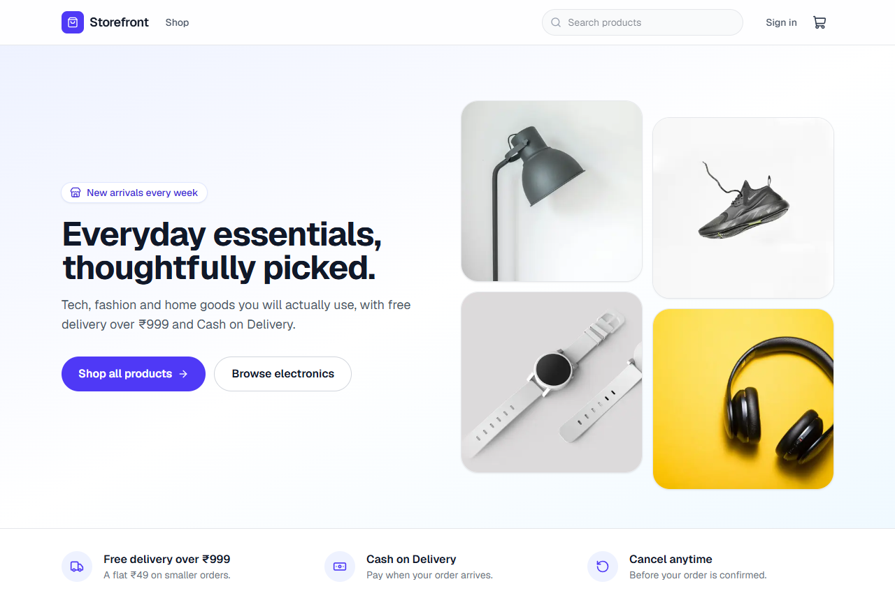
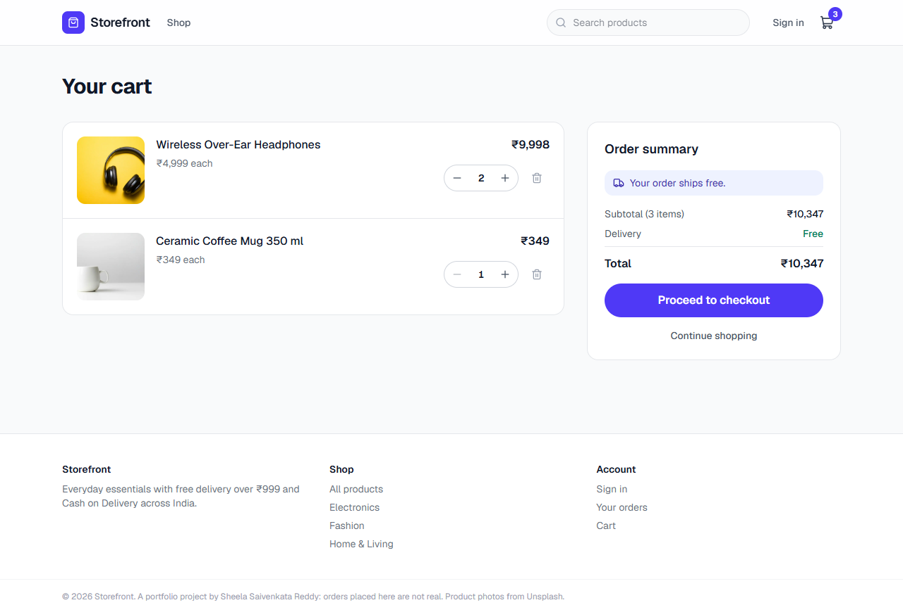
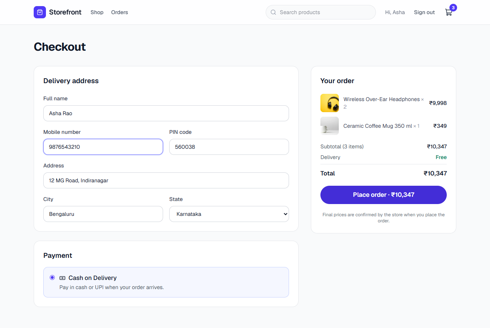
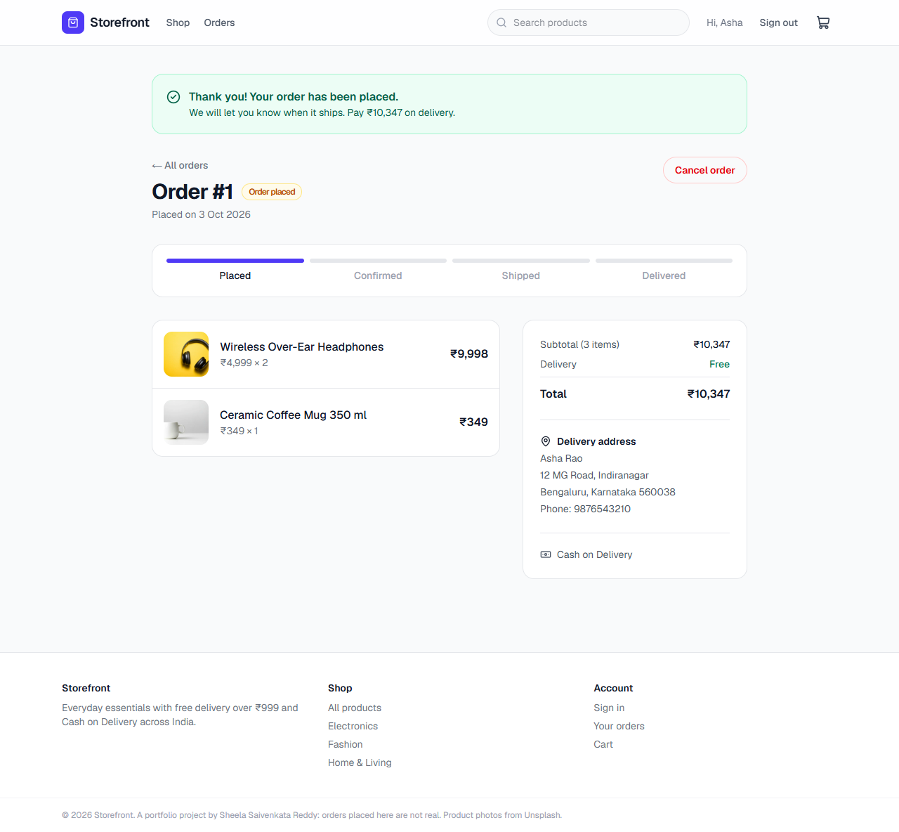
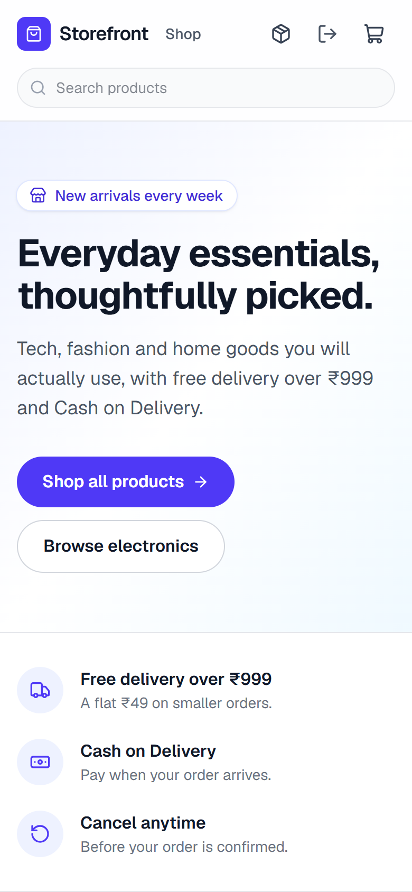
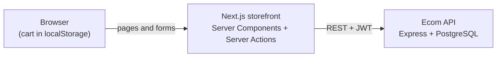

# Ecommerce Storefront

A modern online store built with **Next.js 16, React 19, TypeScript and Tailwind CSS**. Customers can browse and search products, fill a cart, create an account, check out with Cash on Delivery, and track or cancel their orders.

It runs on the [Ecom REST API](https://github.com/sheelasaivenkatareddy/Ecom).

[](https://github.com/sheelasaivenkatareddy/Ecommerce/actions/workflows/ci.yml)




## Features

- **Catalogue** with search, category filters, sorting and pagination
- **Product pages** with stock status, a quantity picker and related products
- **Cart** saved in the browser, with live totals and a free-delivery hint
- **Accounts**: sign up and sign in. The session token lives in an httpOnly cookie that browser scripts cannot read
- **Checkout** with an Indian delivery address form (mobile number, PIN code, list of states) and Cash on Delivery
- **Validation on both sides**: errors appear next to each field and clear as the customer fixes them; the API re-checks everything and always sets the final price
- **Orders**: history, a progress tracker (placed → confirmed → shipped → delivered) and self-service cancellation
- **Responsive and accessible**: works from phones to desktops, with labelled controls and keyboard support
- Real 404 pages, an error page with retry, and optimized images via `next/image`

## Screenshots

| Product page | Cart |
| --- | --- |
|  |  |
| **Checkout** | **Order confirmation** |
|  |  |

<p align="center"></p>

## Tech stack

| Area | Technology |
| --- | --- |
| Framework | Next.js 16 (App Router, Server Components, Server Actions), React 19 |
| Language | TypeScript |
| Styling | Tailwind CSS 4, Lucide icons |
| Cart state | Zustand, persisted to localStorage |
| Validation | Zod |
| Testing | Vitest |
| Tooling | ESLint, GitHub Actions |

## How it works



- **Pages are rendered on the server.** Product data is fetched from the API on every request, so stock and prices are always current.
- **Forms use Server Actions** (sign in, sign up, checkout, cancel). The API token is stored in an httpOnly cookie and only ever travels from the Next.js server to the API.
- **The cart lives in the browser.** At checkout only product ids and quantities are sent; the API works out prices, delivery and stock.

## Getting started

You need **Node.js 20 or newer** and the [Ecom API](https://github.com/sheelasaivenkatareddy/Ecom) running.

1. Start the API in one terminal (it uses a built-in demo database, no setup needed):

   ```bash
   git clone https://github.com/sheelasaivenkatareddy/Ecom.git
   cd Ecom
   npm install
   npm run dev
   ```

2. Start the storefront in another terminal:

   ```bash
   git clone https://github.com/sheelasaivenkatareddy/Ecommerce.git
   cd Ecommerce
   npm install
   npm run dev
   ```

3. Open [http://localhost:3000](http://localhost:3000), add a few products to your cart and create an account at checkout.

## Environment variables

Copy `.env.example` to `.env.local` to change the defaults.

| Variable | Default | Description |
| --- | --- | --- |
| `API_URL` | `http://localhost:4000` | Base URL of the Ecom API. Used only on the server |

## Scripts

| Command | What it does |
| --- | --- |
| `npm run dev` | Start the development server |
| `npm run build` | Build for production |
| `npm start` | Run the production build |
| `npm run lint` | Lint the code |
| `npm run typecheck` | Type-check, including route types |
| `npm test` | Run the unit tests |

## Project structure

```
src/
├── app/            Routes: home, products, product details, cart, checkout, sign in/up, orders
├── actions/        Server Actions for accounts and orders
├── components/     UI: header, product cards, cart, checkout form, order status and more
└── lib/            API client, session, cart logic, validation and formatting
docs/screenshots/   Images used in this README
```

## Testing

```bash
npm test
```

Unit tests cover the cart rules (merging items, stock and quantity limits, totals and the free-delivery threshold), rupee formatting, address and sign-up validation, and protection against unsafe redirects.

## Deployment

- **Storefront**: deploy to Vercel or any Node.js host and set `API_URL`.
- **API**: deploy the [Ecom API](https://github.com/sheelasaivenkatareddy/Ecom) with a PostgreSQL database.

## Credits

Product photos are from [Unsplash](https://unsplash.com). This is a portfolio project: no real orders are fulfilled.

## License

[MIT](LICENSE)
